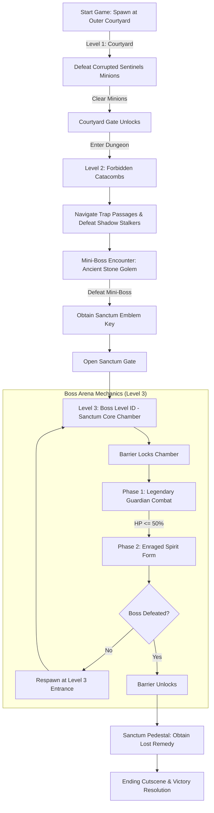

# 🗺️ Layout Peta & Level Mechanics - Sestrina

## Flowchart Level & Stage Progression

```mermaid
graph TD
    A[Start Game: Spawn at Outer Courtyard] -->|Level 1: Courtyard| B[Defeat Corrupted Sentinels Minions]
    B -->|Clear Minions| C[Courtyard Gate Unlocks]
    C -->|Enter Dungeon| D[Level 2: Forbidden Catacombs]
    D --> E[Navigate Trap Passages & Defeat Shadow Stalkers]
    E --> F[Mini-Boss Encounter: Ancient Stone Golem]
    F -->|Defeat Mini-Boss| G[Obtain Sanctum Emblem Key]
    G --> H[Open Sanctum Gate]
    H --> I[Level 3: Boss Level ID - Sanctum Core Chamber]

    subgraph BossArena ["Boss Arena Mechanics (Level 3)"]
        I --> J[Barrier Locks Chamber]
        J --> K[Phase 1: Legendary Guardian Combat]
        K -->|HP <= 50%| L[Phase 2: Enraged Spirit Form]
        L --> M{Boss Defeated?}
        M -- No --> N[Respawn at Level 3 Entrance]
        N --> I
        M -- Yes --> O[Barrier Unlocks]
    end

    O --> P[Sanctum Pedestal: Obtain Lost Remedy]
    P --> Q[Ending Cutscene & Victory Resolution]
```
