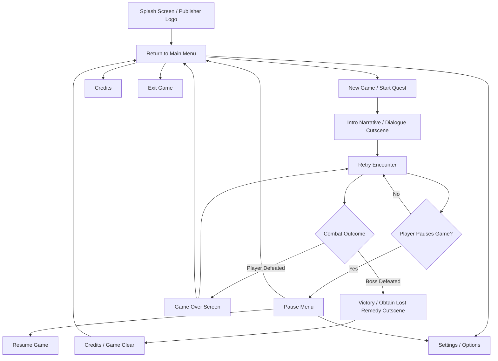
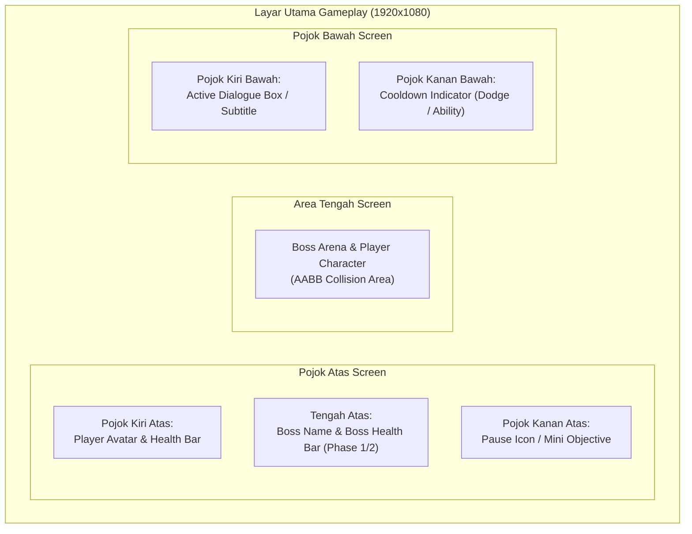

# Diagram Alur Layar UI (UI Flow) - Sestrina

## 1. Navigasi Antarmuka Pemain (Mermaid Flowchart)

```mermaid
graph TD
    A[Splash Screen / Publisher Logo] --> B[Main Menu]
    
    B --> C[New Game / Start Quest]
    B --> D[Settings / Options]
    B --> E[Credits]
    B --> F[Exit Game]

    C --> G[Intro Narrative / Dialogue Cutscene]
    G --> H[Gameplay Screen / Boss Arena HUD]
    
    H --> I{Player Pauses Game?}
    I -- Yes --> J[Pause Menu]
    J --> K[Resume Game]
    J --> D
    J --> B
    I -- No --> H

    H --> L{Combat Outcome}
    L -- Player Defeated --> M[Game Over Screen]
    M --> H[Retry Encounter]
    M --> B[Return to Main Menu]

    L -- Boss Defeated --> N[Victory / Obtain Lost Remedy Cutscene]
    N --> O[Credits / Game Clear]
    O --> B
```

## 2. Layout Antarmuka Gameplay (HUD)

```mermaid
graph TB
    subgraph Screen ["Layar Utama Gameplay (1920x1080)"]
        subgraph TopBar ["Pojok Atas Screen"]
            A["Pojok Kiri Atas:<br/>Player Avatar & Health Bar"]
            B["Tengah Atas:<br/>Boss Name & Boss Health Bar (Phase 1/2)"]
            C["Pojok Kanan Atas:<br/>Pause Icon / Mini Objective"]
        end
        
        subgraph CenterArea ["Area Tengah Screen"]
            D["Boss Arena & Player Character<br/>(AABB Collision Area)"]
        end

        subgraph BottomBar ["Pojok Bawah Screen"]
            E["Pojok Kiri Bawah:<br/>Active Dialogue Box / Subtitle"]
            F["Pojok Kanan Bawah:<br/>Cooldown Indicator (Dodge / Ability)"]
        end
    end
```
